<div align="center">


# Ulap Digital Twin — 6G Propagation Studies

`ULAP ONE` · `RF SCENE TWIN` · `CPU-ONLY`

[Quick start](#try-it-in-60-seconds-no-blender-no-sionna) •
[Examples](examples/) •
[Demos](examples/README.md#apps) •
[Docs](docs/) •
[Community](https://join.slack.com/t/aminicommunity/shared_invite/zt-2sdupq9i9-6c_0shJng6YkEVKmGt~V8A) •
[Paper](research-paper/README.md)

<!-- CI status badges: re-enable the two lines below when this repository becomes
     public. GitHub serves actions/workflows/<file>/badge.svg only to viewers who
     can read the repo, and README images are fetched anonymously through GitHub's
     camo proxy — so on a private/internal repo they render as broken images for
     everyone, including org members. shields.io is no better: its GitHub Actions
     endpoint reports "repo or workflow not found" for the same reason. Both URLs
     below are already correct and point at live workflows; nothing needs editing
     except removing these comment markers.

[](https://github.com/aminitech/amini-ulap-digital-twin/actions/workflows/examples.yml)
[](https://github.com/aminitech/amini-ulap-digital-twin/actions/workflows/ci.yml)
-->
[](ulap-scope/pyproject.toml)
[](ulap-scope/README.md)
[](LICENSE)
[](https://join.slack.com/t/aminicommunity/shared_invite/zt-2sdupq9i9-6c_0shJng6YkEVKmGt~V8A)
[](research-paper/README.md)

</div>

Reproducible **radio-frequency digital twins** for 6G deployment planning. National
geoportal shapefiles + satellite imagery + LiDAR building heights go in; ray-traced
coverage, SINR, mmWave and drive-test studies come out — via **BlenderGIS → Mitsuba →
NVIDIA Sionna RT**, all on CPU. Part of the **Ulap One** project (Amini).

```
     ((♥))                                                  ((♥))
       |            ~  ♥  ~          ~  ♥  ~                  |
      /|\        ♥              ~♥~              ♥           /|\
     / | \          ~   ~                       ~   ~       / | \
    /  |  \                                                /  |  \
   /___|___\             _________________                /___|___\
     NEWTON             | .-------------. |              RISING SUN
      30 m              | |  ulap  ♥ ♥  | |                 24 m
                        | '-------------' |
                        '-----------------'
                         /:::::::::::::::\
                        '-----------------'
```

The pilot study twins the **Newton / Rising Sun** area of south-central Barbados
(2 km box, 576 LiDAR-height buildings, two towers) and ray-traces 1.8–60 GHz.
The papers this work supports are indexed in
[`research-paper/README.md`](research-paper/README.md).

> **This repository ships code, not data.** Every geospatial layer is fetched or
> supplied by you at run time — see [DATA.md](DATA.md). You do not need the
> Barbados layers to use the pipeline: `ulap-scope init` will set up a study
> anywhere in the world from open sources.

---

## Results preview

The twin, built from government footprints draped over the 55–110 m DEM with a
satellite basemap:

| Scene on terrain | Oblique perspective |
|---|---|
| 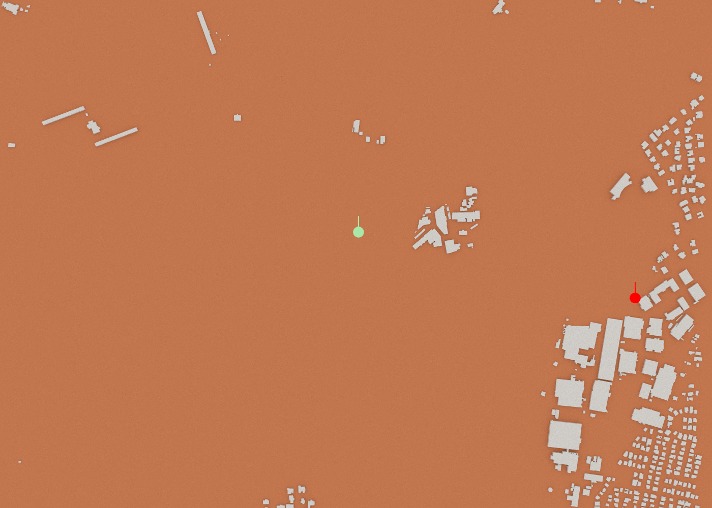 | 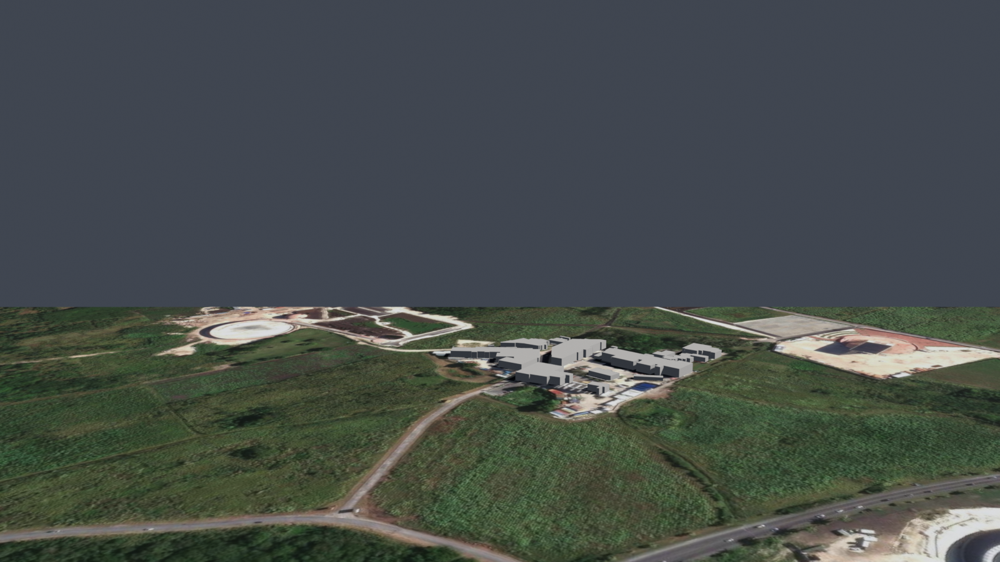 |

**Coverage at 3.5 GHz.** Fidelity matters: the terrain-drape map adds hill
shadowing, and the ground-following 1.5 m (handset-height) map — the one planning
decisions should use — is markedly more fragmented:

| Terrain drape | Ground-following @ 1.5 m AGL |
|---|---|
| 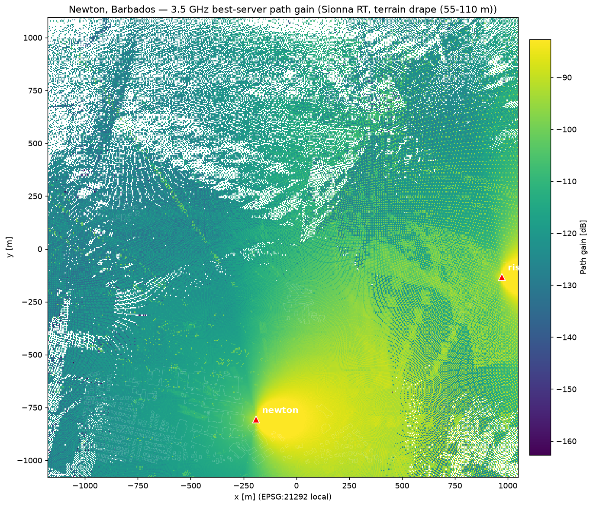 | 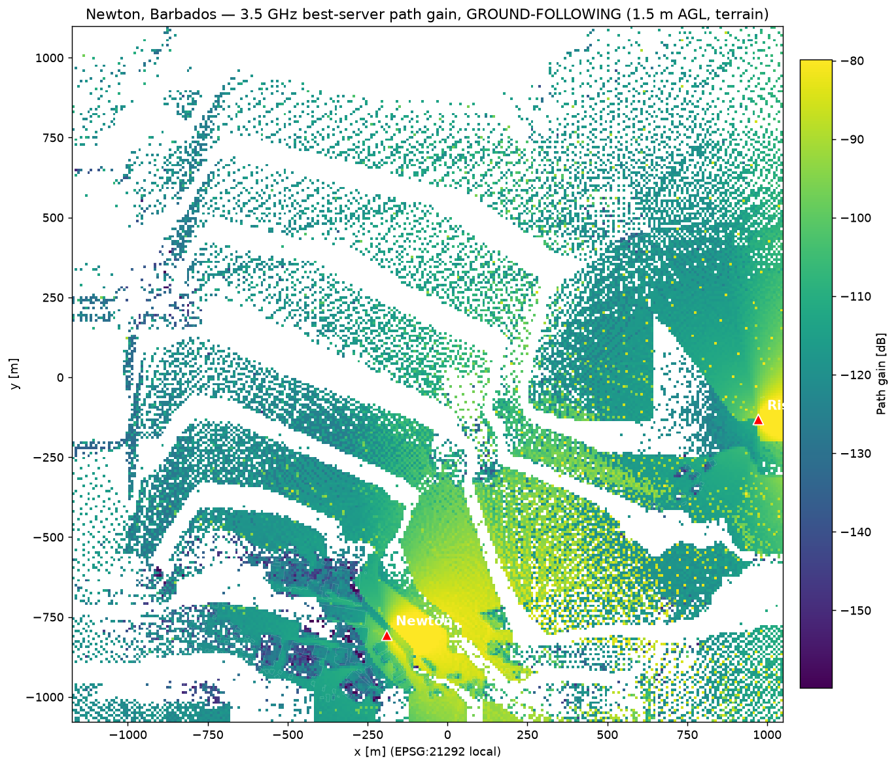 |

**Multi-tower behaviour.** The four-tower SINR map is interference-limited at the
cell edges (a tilt/power/reuse problem, not a coverage-hole problem); best-server
association is dominated by the two in-box towers:

| SINR (4 towers, 2 W, 100 MHz) | Best server / handover |
|---|---|
| 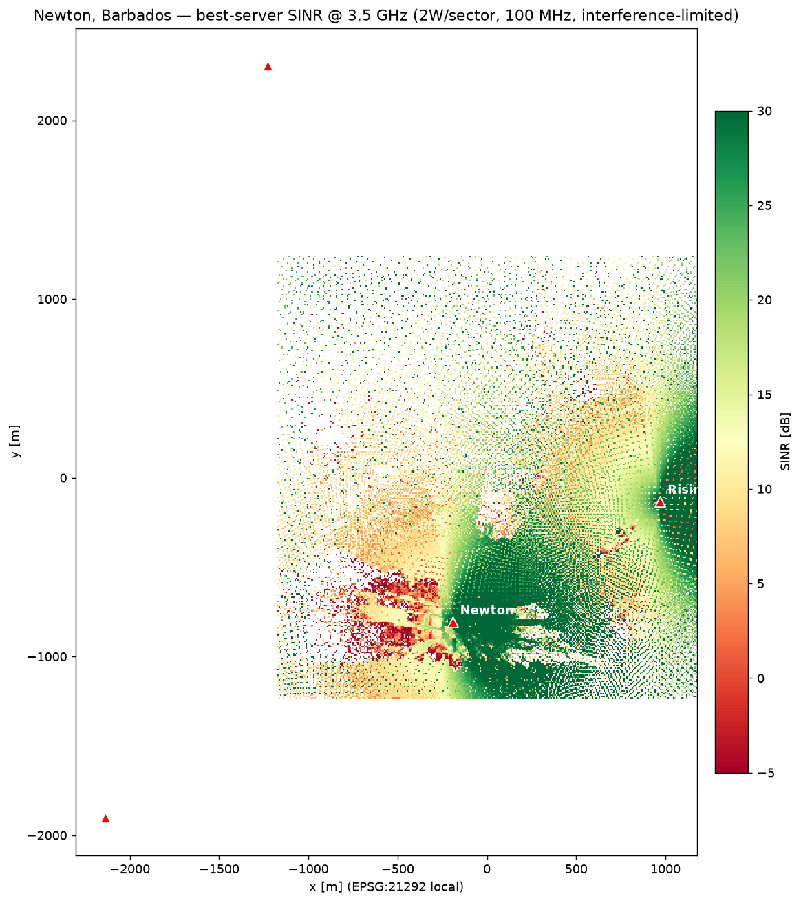 | 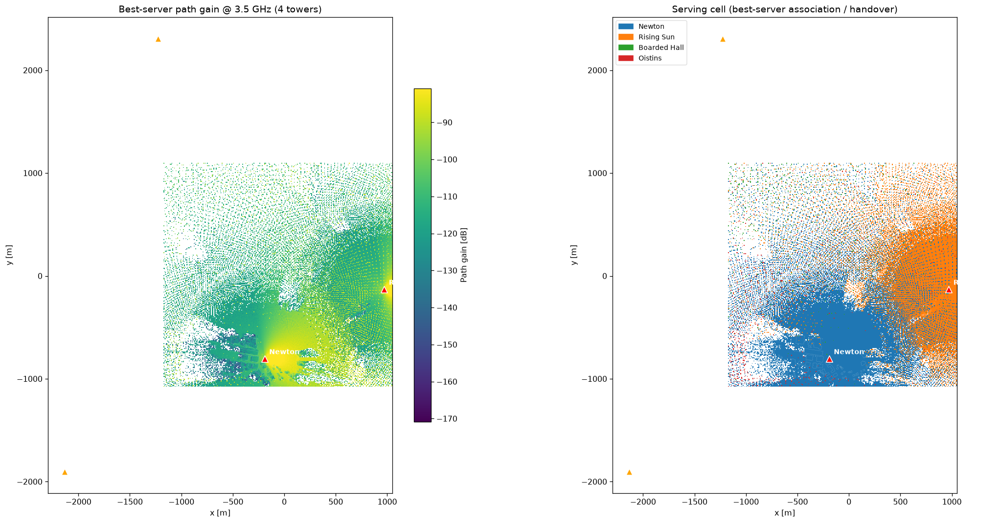 |

**Frequency behaviour.** The 1.8 / 3.5 / 6 / 10 GHz sweep tracks free-space λ²
physics to within ~1 dB — no anomalous excess loss — making **3.5 GHz the
coverage/capacity sweet spot**. mmWave (28/60 GHz, concrete-only) is LoS-only with
large holes: reserve it for fixed-wireless or hotspots.

| Sub-6 sweep | mmWave 28/60 GHz |
|---|---|
| 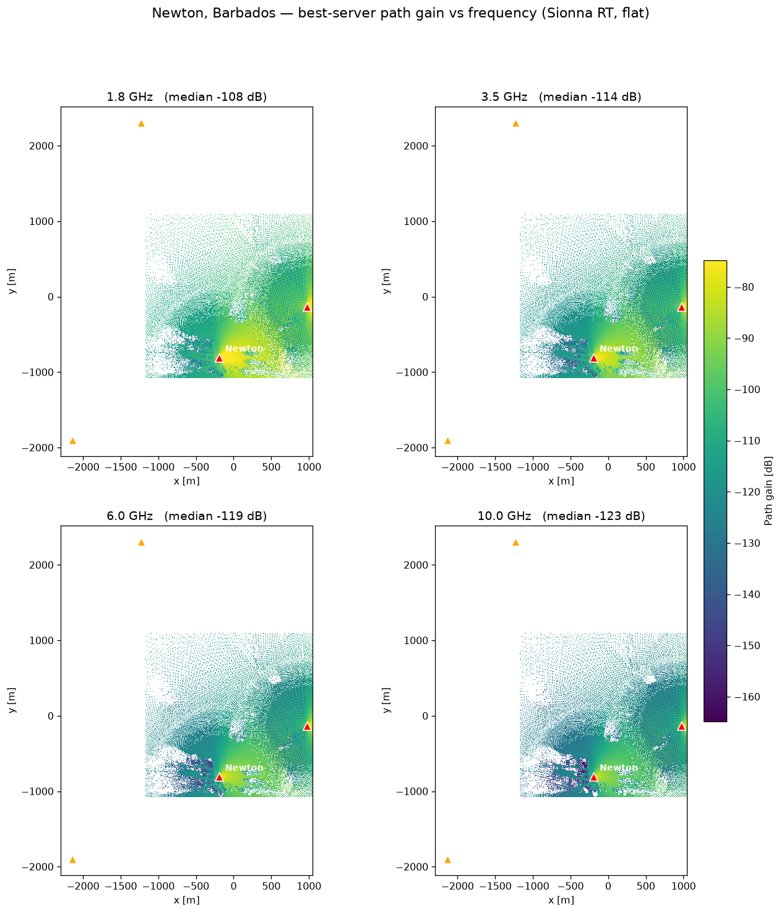 | 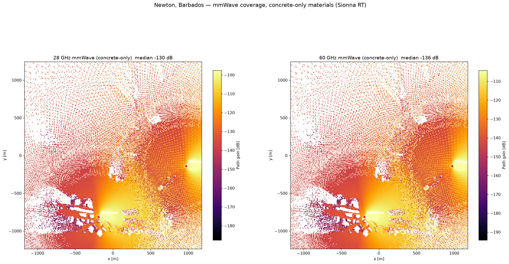 |

**Link physics.** The Rising Sun radial fits a log-distance model with
**n = 1.73** and a 0.15 dB RMS residual — a textbook LoS, ground-reflection-dominated
rural link — with isolated delay-spread spikes (up to 361 ns) where a third ray
appears:

| Link metrics vs distance | Ray geometry check | Radio map in 3D |
|---|---|---|
| 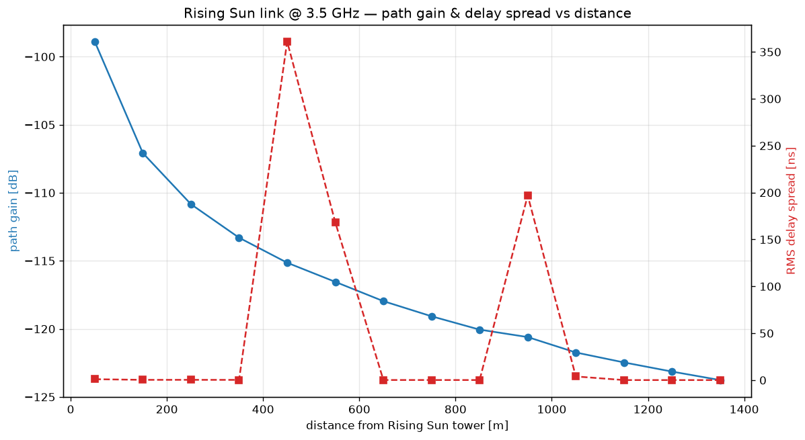 | 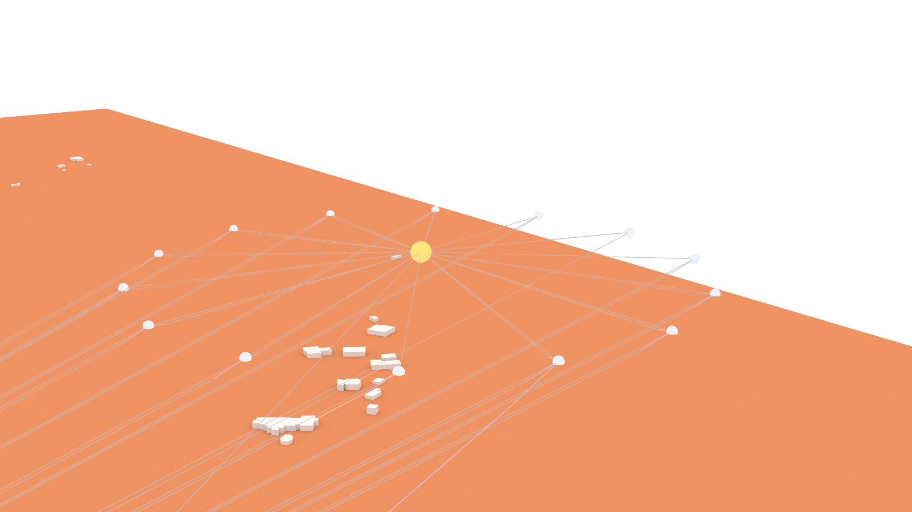 | 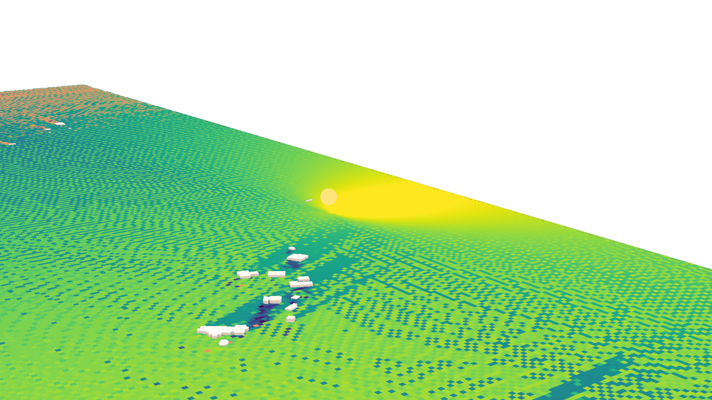 |

**Drive-test replay.** A moving receiver with live best-server tracking and link
budget — the harness for validating handover thresholds:

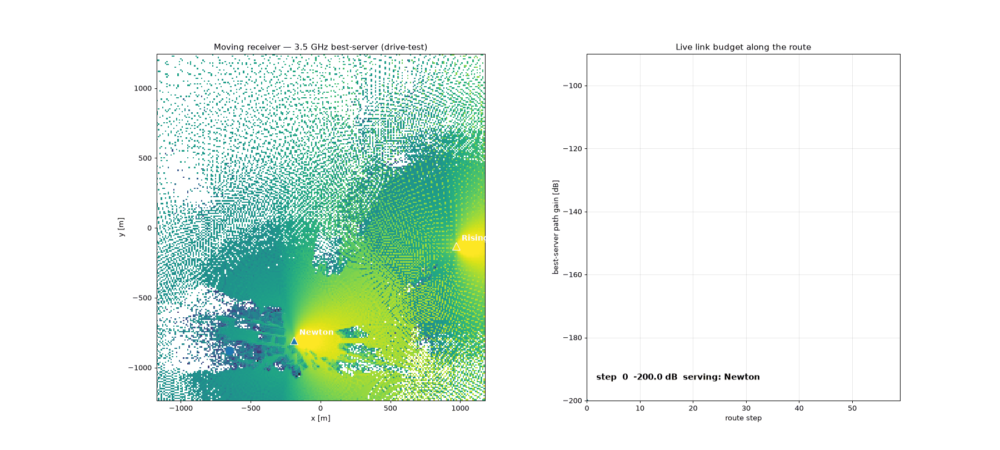

> ⚠️ **These numbers are not field-calibrated.** Known limitations, all of which
> bias results optimistic:
>
> - **Projection distortion** — rebuild in a metric UTM CRS before trusting distances
> - **Optimistic `itu_` materials** — no foliage loss, no rain attenuation
> - **Flat-top building extrusions** — roof detail and clutter are not modelled
> - **No field calibration** — nothing here has been validated against drive-test
>   measurements
>
> Treat the outputs as relative comparisons between configurations, not as
> absolute predicted coverage.

---

## Try it in 60 seconds (no Blender, no Sionna)

The full pipeline needs three Python environments. **[`examples/`](examples/) needs
numpy and matplotlib** — and runs against the real pilot data:

```bash
cd examples
pip install -r requirements.txt
jupyter lab notebooks/                              # 4 guided notebooks
streamlit run apps/coverage_explorer/app.py         # 📡 interactive coverage/SINR
python apps/drive_test/drive_test.py                # 🚗 handover replay → GIF + CSV
python apps/twin_viewer/serve.py                    # 🌐 3-D viewer (stdlib only)
```

They ship a working scene built entirely from **open data** — OpenStreetMap
footprints and AWS terrain tiles, 585 buildings over 57 m of relief — plus genuine
Sionna RT output, and swap the ray tracer for a fast analytical model (free space +
two-ray + knife-edge diffraction). On the pilot's rural LoS radial that model
recovers the ray tracer's path-loss exponent to within 0.05, and is completely blind
to the 361 ns delay-spread spike it found — which is exactly the lesson
[notebook 02](examples/notebooks/02_link_budget.ipynb) is built around.

No licence-restricted layer is committed (see [DATA.md](DATA.md)): point
`$ULAP_SCENE` at your own `scene_manifest.json`, or build one for anywhere on earth
with `python examples/data/fetch_open_scene.py --lon <lon> --lat <lat>`.

| | |
|---|---|
| [01 · Define a study](examples/notebooks/01_define_a_study.ipynb) | bounding boxes, metric CRS traps, band plans, open-data fallbacks |
| [02 · Link budget](examples/notebooks/02_link_budget.ipynb) | real ray-traced data vs. 30 lines of physics — and where it breaks |
| [03 · Scene & terrain](examples/notebooks/03_scene_and_terrain.ipynb) | manifests, footprint rasters, Fresnel clearance, receiver height |
| [04 · Coverage & SINR](examples/notebooks/04_coverage_and_sinr.ipynb) | area maps, band sweeps, geometry ablation, the third-tower trap |

## Reproduce the numbers, and check them

Three directories exist so a third party can verify this work rather than take it on
trust. Each is self-contained and each states its own limitations.

| Path | What it answers | Run it |
|---|---|---|
| [`benchmarks/`](benchmarks/) | What does this actually cost to run, and on what hardware? Three machines (GB10, H200 host, Raspberry Pi 4), CPU and GPU, five stages, three repeats — plus a CPU-classes ladder from 2 cores up. | `python benchmarks/run_bench.py --work-dir <copy of blender/> --python <interpreter with sionna-rt>` |
| [`comparison/`](comparison/) | Is deterministic ray tracing better than the cheap alternatives? Against a closed-form model (C1), against a stochastic 3GPP TR 38.901 surface (C2), and across terrain variants (C3). | `python comparison/c1_rt_vs_analytical.py` (also `c2_`, `c3_`) |
| [`visual/`](visual/) | Do the screenshots regenerate, byte for byte? | `bash visual/run.sh` |

**Start at [`docs/VALIDATION.md`](docs/VALIDATION.md)** — it explains the five layers of
evidence, what each one can and cannot prove, and states honestly where reproduction is
currently gated.

Method and the rules these obey are pre-registered in
[`benchmarks/METHOD.md`](benchmarks/METHOD.md) — written before any measurement was
taken, so results could not be chosen after the fact. Failures are published rather than
dropped; several findings in these directories run against the project's own claims.

You do **not** need the Barbados data for any of this. The Barbados Mitsuba scenes
derive from licence-restricted Geoportal data and are **not distributed**; what ships
instead is the **open-data scene** at `examples/data/open_scene_mitsuba/` (OpenStreetMap
+ open elevation, ODbL — see `NOTICE`), which every ray-tracing stage accepts, with no
Blender required. `benchmarks/run.sh` falls back to it automatically and says so. Build
one for any location with `python examples/data/fetch_open_scene.py --lon <lon> --lat
<lat>`. The Barbados numbers themselves remain reproducible only with the restricted
data — `DATA.md` documents a verification path for holders of it.

## Architecture

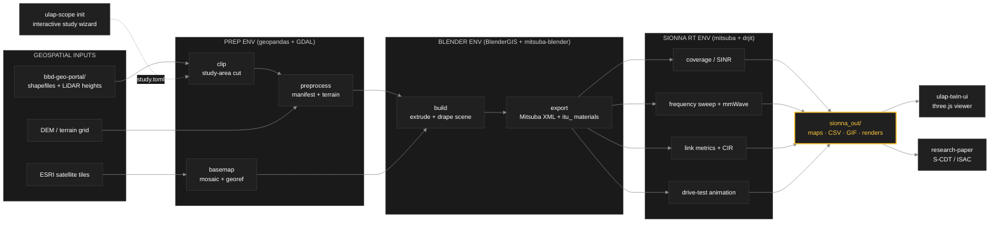

See [docs/ARCHITECTURE.md](docs/ARCHITECTURE.md) for the component walk-through and
[docs/scdt-architecture.png](docs/scdt-architecture.png) for how this pipeline slots
into the wider **Sovereign Cognitive Digital Twin (S-CDT)** stack from the paper.
That figure is generated from [`docs/diagrams/`](docs/diagrams/README.md) — edit the
Mermaid source and re-run `render.sh`; never hand-edit the PNG.

## Concepts

Nine hand-drawn explainers for the ideas behind the twin, one per cognitive
anchor in the paper — from the perception gap through to the
built-versus-specified boundary. Full index and placement notes in
[`docs/illustrations/`](docs/illustrations/README.md).

| | |
|---|---|
| 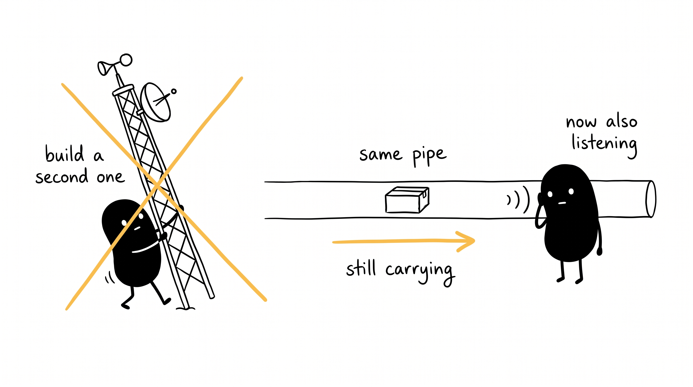 | 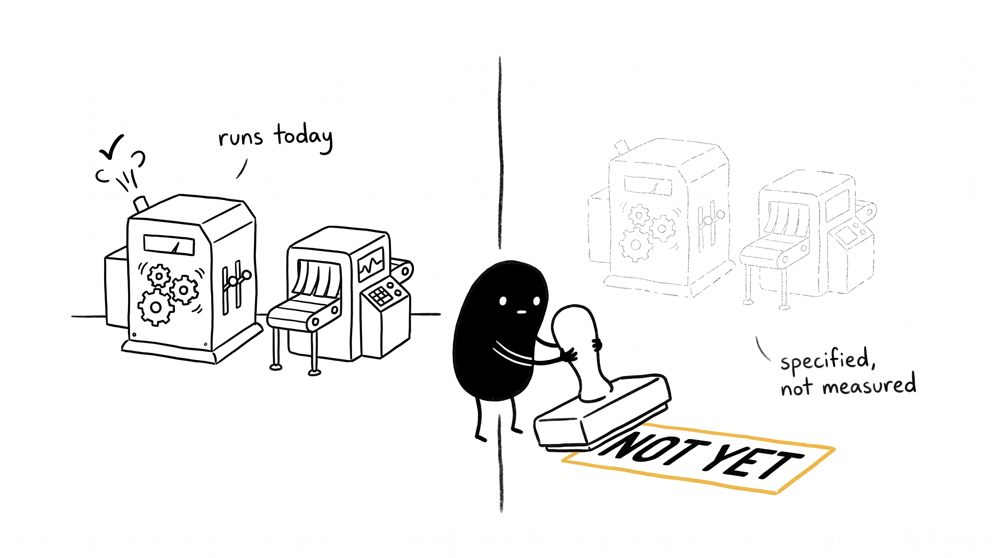 |
| **Network as a sensor.** Stop erecting a second mast — the pipe already carrying the traffic can be listened to. | **Built vs. specified.** What runs today, and what is not built yet. Read this before going looking for an ISAC feed. |

## Repository layout

| Path | What it is |
|---|---|
| [`ulap-scope/`](ulap-scope/) | **The pipeline.** Installable Python package + `ulap-scope` CLI: config, geo core, stage runner, interactive study wizard, pytest harness |
| [`examples/`](examples/) | **Start here.** Four notebooks and three local apps that run on numpy + matplotlib, with an open-data sample scene and a builder for your own area |
| [`blender/`](blender/) | **Working directory** — the pipeline writes Blender scenes, Mitsuba exports and `sionna_out/` results here at run time. Its contents are regenerable and geoportal-derived, so they are not committed ([DATA.md](DATA.md)) |
| [`BlenderGIS/`](BlenderGIS/) | Git submodule: georeferenced imports/basemaps in Blender (GPL-3.0, fetched from upstream) |
| [`mitsuba-blender/`](mitsuba-blender/) | Git submodule: Blender → Mitsuba XML export (BSD-3-Clause, fetched from upstream) |
| [`ulap-twin-ui/`](ulap-twin-ui/) | three.js web viewer for the twin |
| [`research-paper/`](research-paper/README.md) | Index of published papers with abstracts, DOIs and citations. No paper sources — those live in the papers repository |
| [`scripts/`](scripts/) | `check_data.sh` — verify your geospatial layers before a run |
| [`docs/`](docs/) | Architecture notes + curated renders used above |
| [`openspec/`](openspec/) | OpenSpec specs & change proposals for the pipeline and CLI |

Not in this repository: **geospatial data**. `bbd-geo-portal/` is where the
pipeline looks for it by default, but nothing under it is committed. See
[DATA.md](DATA.md).

## Quickstart

```bash
git clone --recurse-submodules https://github.com/aminitech/amini-ulap-digital-twin.git
cd amini-ulap-digital-twin/ulap-scope
pip install -e .        # light install: numpy only
ulap-scope init         # 💻♥📡 interactive wizard — define a NEW study anywhere
ulap-scope info         # show resolved config/paths
ulap-scope all          # clip → preprocess → basemap → build → export → RT stages
```

The submodules matter: `--recurse-submodules` fetches BlenderGIS and
mitsuba-blender from upstream. If you already cloned without it, run
`git submodule update --init --recursive`.

## Reproducing the paper

**Cite and clone a tag, never `main`.** `main` moves; a paper's results do not.
Every figure and number in the paper corresponds to one tagged release, archived
on Zenodo with its own DOI.

```bash
# replace <TAG> with the release named in the paper's code availability statement
git clone --recurse-submodules --branch <TAG> \
  https://github.com/aminitech/amini-ulap-digital-twin.git
```

| | |
|---|---|
| **Release tag** | *not yet tagged — see [ULAP-15](https://linear.app/aminitech/issue/ULAP-15)* |
| **Version DOI** | *not yet minted (Zenodo requires a public repository)* |
| **Which figure came from which command** | [`docs/renders/README.md`](docs/renders/README.md) |
| **What the numbers depend on** | [`docs/REPOSITORY_AUDIT.md`](docs/REPOSITORY_AUDIT.md) |

> ⚠️ **Read this before attempting to reproduce a figure.** Seven of the eight
> Sionna RT solver invocations are **unseeded** Monte Carlo at 10⁶–10⁷ samples per
> transmitter, so re-running a stage produces a statistically similar but **not
> identical** map, and the run-to-run variance has not yet been measured. Until
> that is fixed, [`docs/renders/README.md`](docs/renders/README.md) tells you the
> command that *produced* each figure; it is not yet a promise that the command
> *reproduces* it to a stated tolerance. The one number currently guarded by a
> test is the log-distance fit on the Rising Sun transect (`n = 1.73 ± 0.02`,
> RMS < 0.3 dB — `examples/tests/test_ulap_demo.py`).

To reproduce the **Barbados** figures you additionally need the Barbados
Geoportal layers, which we cannot redistribute — [DATA.md](DATA.md) lists every
layer, its source and its status. To reproduce the *method* on data you can
obtain freely, use the open-data path below or
`examples/data/fetch_open_scene.py`.

## Reproducing the paper

Papers that cite `main` cite a moving target. The S-CDT paper's numbers come from the
tree tagged **`v1.0-paper2`** — reproduce against that tag, not against whatever `main`
has become since:

```sh
git clone --branch v1.0-paper2 --depth 1 https://github.com/aminitech/aminiulap-digital-twin.git
cd aminiulap-digital-twin
python3 -m venv venv && ./venv/bin/pip install -r examples/requirements.txt
(cd examples  && ../venv/bin/python -m pytest -q)     # expect: 78+ passed
(cd ulap-scope && ../venv/bin/python -m pytest -q)    # expect: all passed
./venv/bin/pip install -r claims/requirements.txt
./venv/bin/python claims/verify_claims.py             # the paper vs its artefacts
```

What to expect, measured at this tag on three machines (NVIDIA GB10, an H200 host,
and a Raspberry Pi 4): every test suite passes; the claims gate reports **0 failures**
on every machine; and a from-scratch re-run of the ray-tracing producers on a second
architecture reproduced the abstract's sweep medians to the digit and an identical
`link_metrics.csv` checksum (`08afea6d…`). What the open release can and cannot
reproduce is stated in `docs/VALIDATION.md` — the Barbados numbers need the
licence-restricted data (`DATA.md` documents the verification path for holders);
everything else runs from the shipped open-data scene.

Once the Zenodo archive exists, cite the **version DOI** (see `CITATION.cff`), which
resolves to this exact tree forever.

## Reproduction path

From a clean clone to a figure, with no access to any non-public data:

1. **Clone with submodules** and install the package, as above.
2. **Define a study area.** `ulap-scope init` walks you through location,
   bounding box and projection, recommends a UTM zone, and writes `study.toml`.
   Pick anywhere — the pipeline is not Barbados-specific.
3. **Point at your data.** `export ULAP_DATA_DIR=/path/to/your/shapefiles`, then
   run `./scripts/check_data.sh` to confirm the layout. For a new study area the
   wizard recommends open sources (OSM footprints, Copernicus GLO-30 DEM, ESRI
   World Imagery) for anything you do not already have.
4. **Confirm resolved paths** with `ulap-scope info` before spending compute.
5. **Run the pipeline.** `ulap-scope all` runs clip → preprocess → basemap →
   build → export → RT. Heavy stages need their own interpreters — see
   [`ulap-scope/README.md`](ulap-scope/README.md) for the three pinned
   environments.
6. **Find your outputs** in `blender/sionna_out/`. These are the same stages that
   produced the coverage, path-gain and SINR figures in
   [`docs/renders/`](docs/renders/) above.

To reproduce the **Barbados** figures specifically you additionally need the
Barbados Geoportal layers, which we cannot redistribute. [DATA.md](DATA.md)
lists every layer, its source and its status.

`ulap-scope init` asks for the study location, bounding box, projection (with a
computed UTM recommendation), the signals to model, and the geospatial layers you
have — recommending open sources (OSM footprints, Copernicus GLO-30 DEM, ESRI
imagery) for anything you don't — then writes a versioned `study.toml`:

```
      ((♥))          ((♥))
       /|\   ~ ♥ ~    /|\        Ulap Study Wizard
      /_|_\  ~ ♥ ~   /_|_\       tell us about your study area
              ____
             |ulap|  ♥ ♥
             '----'

  Study name [newton-bbd]:
  Longitude of study centre [-59.533908]:
  ...
  ♥ recommended projection: EPSG:32621 (UTM zone 21N) — true metres for link budgets
  ♥ no DEM? we recommend Copernicus GLO-30 (30 m, global, free)
```

> ⚠️ **`study.toml` does not drive the pipeline stages yet.** The wizard writes
> it, and it is the intended scientific record, but the stages still read their
> parameters from `ulap_scope/config.py` and their solver settings from hard-coded
> values inside each stage script. Connecting the two is the proposed change
> `apply-study-config` (`openspec/changes/`). Until it lands, treat
> [`docs/renders/README.md`](docs/renders/README.md) as the authoritative record
> of what produced a given figure.

Heavy stages need their own interpreters (no single env can host GDAL, bpy *and*
Sionna). See [`ulap-scope/README.md`](ulap-scope/README.md) for the three pinned
environments and per-machine env-var overrides.

## Tests

```bash
cd ulap-scope
make test       # fast unit suite: geo math, config, manifest, wizard, study spec
make test-rt    # integration smoke in the Sionna env (loads exported scene)
```

CI runs the fast suite on Python 3.10–3.12. The wizard/study tests are pure
stdlib and run anywhere.

## Specs

The intended behaviour of the pipeline and CLI is captured as
[OpenSpec](openspec/) requirements — start at
[`openspec/project.md`](openspec/project.md). New capabilities land as change
proposals under `openspec/changes/` before implementation.

## Contributing

Contributions welcome — see [CONTRIBUTING.md](CONTRIBUTING.md) and our
[Code of Conduct](CODE_OF_CONDUCT.md).

## Citing

If you use this software, cite it via [`CITATION.cff`](CITATION.cff) — GitHub
renders a "Cite this repository" button from it. Cite the accompanying papers
separately; abstracts, DOIs and BibTeX are in
[`research-paper/README.md`](research-paper/README.md).

## Security

Report vulnerabilities privately — see [SECURITY.md](SECURITY.md). That includes
reports that something in this repository discloses sensitive infrastructure
geometry.

## License

**[Apache-2.0](LICENSE)** for this repository, including the `ulap-scope`
package. Apache-2.0 was chosen over MIT for its express patent grant and
defensive-termination clause.

The submodules are **not** covered by that licence and are not redistributed
here — they are fetched from upstream and keep their own terms:
[BlenderGIS](https://github.com/domlysz/BlenderGIS) is **GPL-3.0**,
[mitsuba-blender](https://github.com/mitsuba-renderer/mitsuba-blender) is
**BSD-3-Clause**.

Geospatial data is not in this repository at all and is subject to its own
source terms. See [NOTICE](NOTICE) for all third-party attributions and
[DATA.md](DATA.md) for per-layer provenance.

---

*Built with ♥ in the Caribbean, for resilient sovereign networks.*
