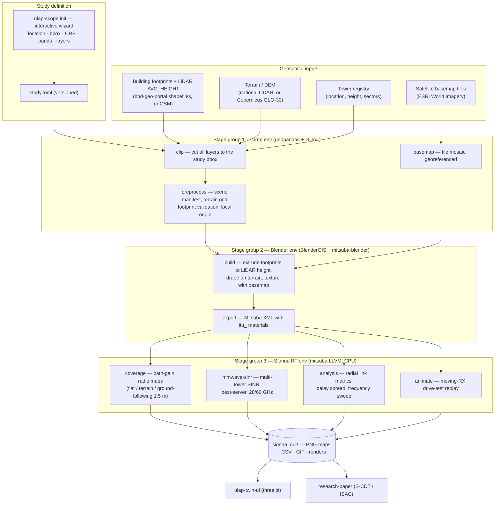
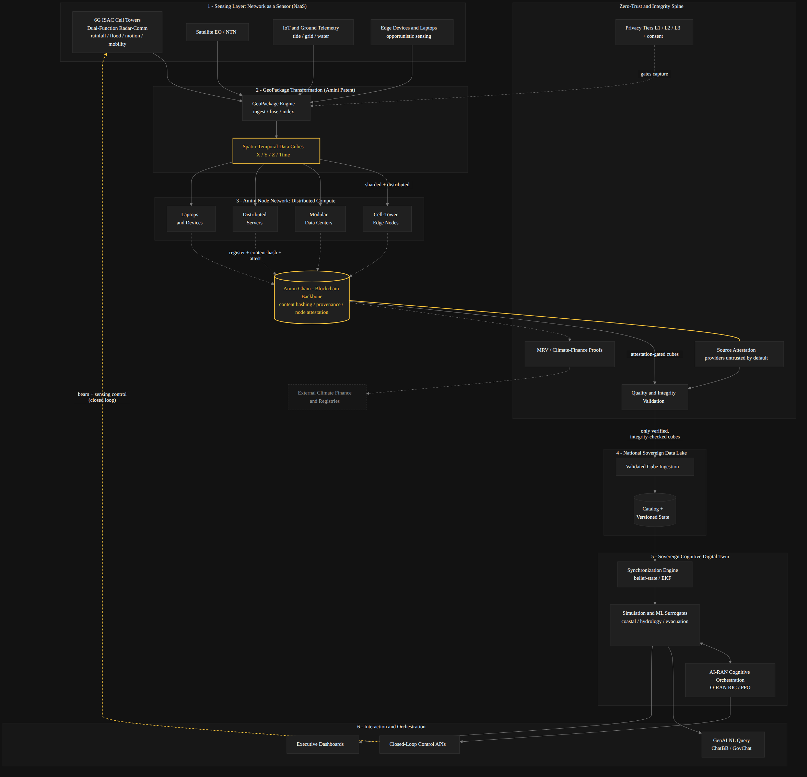

# Architecture

How a pile of shapefiles becomes a ray-traced 6G propagation study.

## The pipeline at a glance

## Why three Python environments?

No single interpreter can host GDAL/geopandas, Blender's `bpy`, **and**
Sionna RT/DrJit simultaneously — their binary deps conflict. So
`ulap_scope.pipeline` runs each stage **out-of-process** in the right
interpreter, passing state through files (`scene_manifest.json`,
`towers_near.json`, Mitsuba XML) under `$ULAP_WORK_DIR`:

| Env | Runs | Key deps |
|---|---|---|
| **prep** | clip, preprocess, basemap | geopandas, GDAL, pyproj, pillow |
| **Blender** | build, export | bpy 4.4, BlenderGIS, mitsuba-blender, mitsuba 3.5 |
| **RT** | coverage, analysis, mmwave, terrain-ground, animate | sionna-rt 2.0.1, mitsuba 3.8, drjit |

Everything is CPU-only (Mitsuba LLVM backend) — no CUDA required, so studies run
on a laptop. ((♥)) → 💻

## Key design decisions

- **File-based contracts between stages.** Each stage reads/writes plain files;
  any stage can be re-run in isolation, and the manifest is validated by the
  fast test suite (`tests/test_manifest.py`) without any GIS deps installed.
- **Config over code.** All physics/geometry parameters (CRS, origin, bbox,
  bands, TX power, solver depth/samples) live in `ulap_scope/config.py`,
  env-overridable; `ulap-scope init` generalizes this into a per-study
  `study.toml` so the pipeline is reusable beyond Barbados.
- **Projection honesty.** Scenes assembled in Web Mercator stretch distances
  (~2.6% at 13°N) — link budgets inherit that error. The wizard therefore
  *computes* and recommends the metric UTM zone for the study longitude and
  warns whenever a non-metric CRS is chosen.
- **Fidelity tiers.** Every coverage product exists as flat / terrain-drape /
  ground-following@1.5 m. Planning decisions use ground-following; flat is for
  relative comparisons only (e.g. the frequency sweep).
- **Vendored add-ons.** BlenderGIS and mitsuba-blender are vendored for
  reproducibility (pinned revisions), never patched in-tree.

## Where this sits in the S-CDT stack

This repo is the **propagation-study engine** of the wider Sovereign Climate
Digital Twin architecture (sensing layer → geo-cubes → node network → sovereign
data lake) described in the [research paper](../research-paper/):

The RT outputs are the seed of the ISAC/network-as-sensor roadmap: per-path
channel impulse responses (delay, angle, Doppler) logged from the twin become
the sensing observables of the deployed network.
