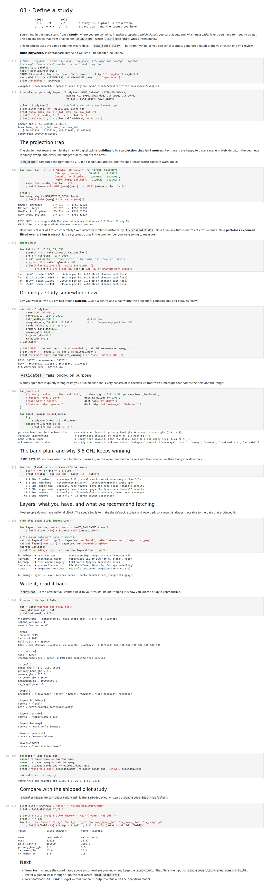
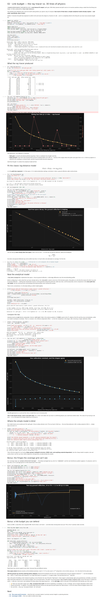
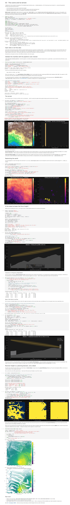
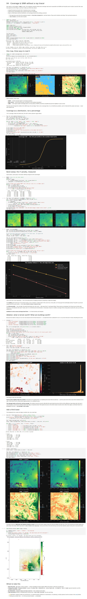

# The notebooks, executed everywhere

The four numbered notebooks are this repository's teaching layer — the path a reader
takes from "what is a study?" to coverage and SINR maps without installing a ray
tracer. A notebook that has only ever run on its author's machine is a promise, not
evidence, so each one was executed **top to bottom with a fresh kernel** on every
machine below, using one runner script (`nbclient`, 1800 s timeout, fail on first
errored cell). Timings are a single run each — these are smoke-level portability
numbers, not benchmarks; the pre-registered benchmark discipline in
`benchmarks/METHOD.md` does not apply here and no performance claim is made from them.

## Results by host

| Host | CPU | Arch | Python | 01 | 02 | 03 | 04 | Verdict |
|---|---|---|---|---|---|---|---|---|
| spark-5804 | NVIDIA GB10, 20 cores | aarch64 | 3.12.3 | 0.97 s | 1.46 s | 2.54 s | 4.44 s | **4/4 PASS** |
| bgi-ran-01 | Xeon host (H200 box), 256 cores | x86_64 | 3.9.25 | 1.03 s | 2.11 s | 3.75 s | 7.88 s | **4/4 PASS** |
| pi4-1 | Raspberry Pi 4, Cortex-A72 ×4 | aarch64 | 3.13.5 | 3.39 s | 8.39 s | 18.51 s | 41.21 s | **4/4 PASS** — completed after the pinned-wheel install finally beat the degraded uplink (the pending row this replaced is in git history) |
| m2mkm (MacBook M2) | Apple M2 | arm64 | — | — | — | — | — | **unreachable** — TCP 22 accepts then closes; no offered user/key admitted. Published as a failure, not omitted. |

Three operating Python versions (3.9 / 3.12 / 3.13) and two architectures pass
unmodified — the version spread is itself a compatibility result, not an accident
of provisioning.

The per-host wall clocks are not comparable to each other in any precise sense
(different Python versions, single runs, the Pi passively cooled) — the only claim
made from this table is the **Verdict** column.

## Where is the GPU column?

There deliberately isn't one. An import scan of all four notebooks finds no
`sionna`, `mitsuba`, or `drjit` — they consume the *shipped* ray-traced artefacts
(`examples/data/`) with numpy and matplotlib only. That is the design: a reader with
no GPU, no Sionna, and no licence-restricted data can still open, run, and
interrogate every number the notebooks show. The CPU-vs-GPU story belongs to the
pipeline stages that *produced* those artefacts, and it is measured there: see
`benchmarks/` (full matrix, three machines) — at the raised sampling default the
ground-following stack is 7.6 s on the GB10 GPU against 262 s CPU-only, and
4 852 s on this same Pi 4.

## What each notebook demonstrates

**01 · Define a study** — a study is a place, a projection, and a band plan as a
versioned `study.toml`. The heart of it is the **projection trap**: Web Mercator
stretches distance by 1/cos(latitude), and the notebook computes the phantom
path-loss error this injects per degree of latitude (up to 4.8 dB per km at 55°),
then shows `validate()` rejecting five deliberately wrong specs *loudly*. Round-trips
the spec to disk and back, and diffs a fresh Nairobi study against the shipped
Barbados pilot.



**02 · Link budget** — the credibility notebook: 30 lines of textbook physics
(free-space + two-ray) tracked against the shipped ray-traced transect, reproducing
the C1 finding that on an open radial the expensive solver and the closed-form model
agree to sub-dB — which is precisely how you know where determinism is *not* needed.



**03 · The scene and its terrain** — "open data is not free data": validates the
scene manifest with the pipeline's own checker, rasterises terrain + buildings, then
walks a tower-to-tower link through line-of-sight, frequency-dependent Fresnel
clearance, and a shadowed link — ending on the point that **receiver height is a
planning decision, not a detail** (the ground-following argument, taught before the
ray tracer ever appears).



**04 · Coverage & SINR without a ray tracer** — one map read three ways (RSRP,
best-server, SINR), coverage as a **distribution rather than a percentage** (the
10th percentile is the number that hurts), the λ² band penalty measured against the
shipped sweep, an ablation asking what terrain and buildings are each worth, and
adding a third tower — the association-not-medians argument of the paper, hands-on.



## Keeping it true

One-off runs rot, so "the notebooks execute" is enforced two ways:

- `tests/test_notebooks_execute.py` runs all four under pytest with a fresh kernel
  (skips visibly when `nbclient`/`ipykernel` are absent);
- the notebooks are committed **outputs-stripped** — there is no stored output to go
  stale, so execution is the only way they can show anything at all.

Reproduce any row of the table:

```sh
cd examples
python -m venv venv && venv/bin/pip install numpy matplotlib nbformat nbclient ipykernel
venv/bin/python -m pytest tests/test_notebooks_execute.py -q
```

The screenshots above are full-page captures of the nbconvert-rendered executed
notebooks (spark-5804, chromium, 1400 px viewport), downscaled to 1100 px.
